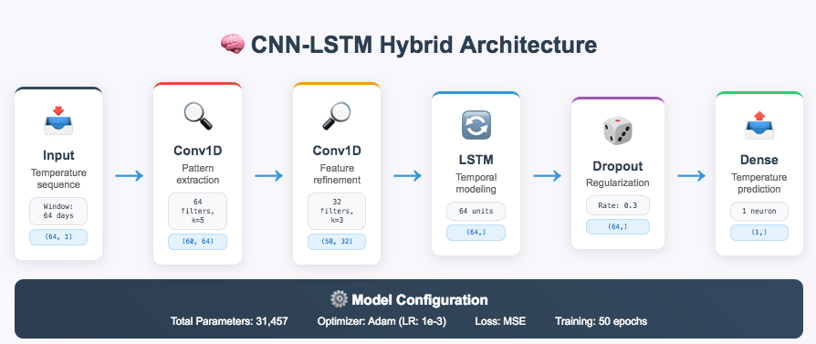
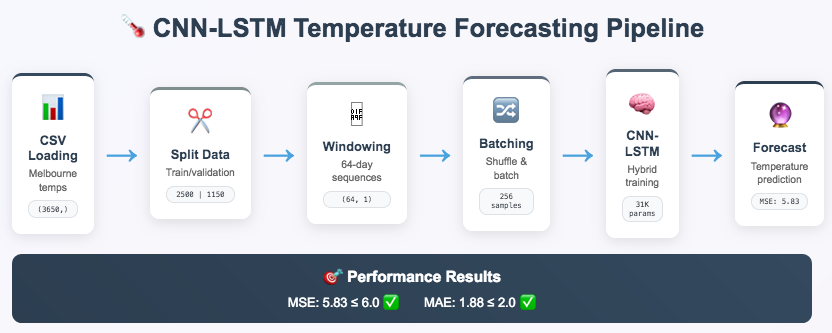
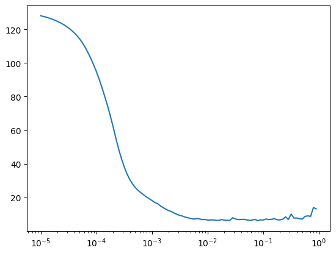
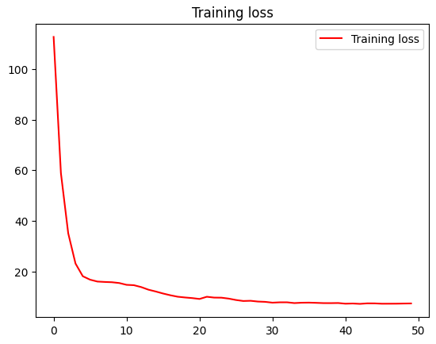
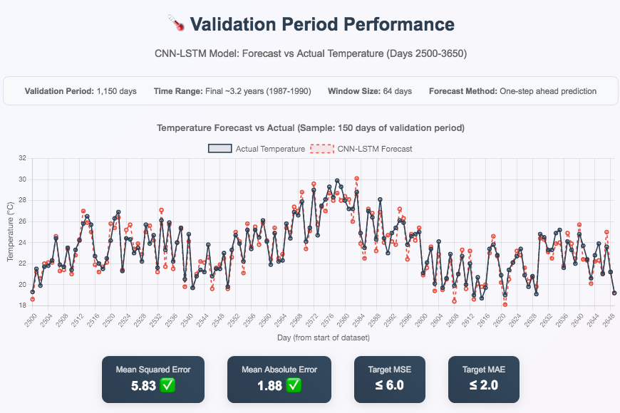

# CNN-LSTM Time Series Forecasting 🌡️

[](https://www.tensorflow.org/)
[](https://www.python.org/)
[](https://numpy.org/)
[](https://matplotlib.org/)
[](https://www.deeplearning.ai/)
[](https://jupyter.org/)

## Overview 📖

This project demonstrates **CNN-LSTM hybrid neural networks for time series forecasting** using real-world temperature data from Melbourne (1981-1990). By combining Convolutional Neural Networks for local pattern recognition with Long Short-Term Memory networks for temporal dependencies, we achieve superior forecasting performance that surpasses traditional approaches.

**Temperature patterns reveal seasonal cycles, trends, and complex dependencies.** Understanding and predicting these patterns is crucial for climate research, agricultural planning, energy management, and environmental monitoring. This repository showcases how modern deep learning architectures can capture both local patterns and long-term temporal relationships in meteorological data.

💡 **Educational Focus:** This project emphasizes the practical implementation of hybrid CNN-LSTM architectures with proper learning rate optimization, data windowing strategies, and performance evaluation on real-world time series data.

---

## Table of Contents 📑

- [Overview](#overview-)
- [Project Architecture](#project-architecture-)
- [Dataset](#dataset-)
- [Getting Started](#getting-started-)
- [Code Structure](#-code-structure)
- [Neural Network Architecture](#neural-network-architecture-)
- [Data Processing Pipeline](#data-processing-pipeline-)
- [Learning Rate Optimization](#learning-rate-optimization-)
- [Results & Performance](#results--performance-)
- [Implementation Details](#implementation-details-)
- [Key Features](#key-features-)
- [Practical Applications](#practical-applications-)
- [Future Enhancements](#future-enhancements-)
- [Acknowledgements](#acknowledgements-)
- [Contact](#contact-)

---

## Project Architecture 🏗️

The CNN-LSTM forecasting system follows a sophisticated approach combining the best of both architectures:

- **Data Parsing:** Real-world CSV temperature data preprocessing
- **Windowing Strategy:** Sliding window technique for supervised learning
- **Hybrid Architecture:** CNN for local pattern extraction + LSTM for temporal modeling
- **Learning Rate Optimization:** Empirical LR finding with exponential scheduling
- **Training Pipeline:** Efficient batch processing with proper validation splits
- **Forecasting Engine:** Fast batch-based prediction system
- **Performance Evaluation:** Comprehensive MSE and MAE metrics

Each component is designed for **robustness**, **efficiency**, and **real-world applicability** in meteorological forecasting.

---

## Dataset 📦

Our time series uses real daily minimum temperature recordings from Melbourne, providing authentic patterns for model validation:


### **Data Characteristics:**
- **Source:** Daily Minimum Temperatures in Melbourne (1981-1990)
- **Time Span:** 10 years of daily observations (3,650 data points)
- **Temperature Range:** Celsius measurements with seasonal variations

### **Temporal Components:**
- **Seasonal Patterns:** Clear annual temperature cycles
- **Weather Variability:** Day-to-day temperature fluctuations  
- **Long-term Trends:** Subtle climate pattern evolution
- **Real-world Complexity:** Authentic meteorological characteristics

### **Data Split Strategy:**
- **Training Set:** First 2,500 days (68%) - Model learning period
- **Validation Set:** Remaining 1,150 days (32%) - Performance evaluation
- **Split Method:** Chronological split preserving temporal order

### **Purpose & Design:**
- **Real-world Application:** Demonstrates practical forecasting on authentic data
- **Complexity Level:** Suitable for advanced neural network architectures
- **Performance Target:** MSE ≤ 6.0, MAE ≤ 2.0 for successful forecasting
- **Educational Value:** Shows progression from simple to sophisticated models

---

## Getting Started 🛠️

### Prerequisites

- Python 3.6+
- TensorFlow 2.x
- NumPy
- Matplotlib
- Pandas (for CSV handling)

### Installation

```bash
git clone https://github.com/yourusername/cnn-lstm-temperature-forecasting
cd cnn-lstm-temperature-forecasting
pip install -r requirements.txt
```

### Quick Start

```python
# Import the main components
from temperature_forecasting import parse_data_from_file, windowed_dataset, create_model

# Load Melbourne temperature data
TIME, SERIES = parse_data_from_file('./data/daily-min-temperatures.csv')

# Create windowed dataset for training
train_dataset = windowed_dataset(series_train, window_size=64)

# Build and train the CNN-LSTM hybrid model
model = create_model()
history = model.fit(train_dataset, epochs=50)

# Generate temperature forecasts
forecast = model_forecast(model, SERIES, window_size=64)
```

### Usage

1. **Complete Analysis:** Run `temperature_forecasting.py` for full pipeline
2. **Learning Rate Optimization:** Use `adjust_learning_rate()` for LR finding
3. **Custom Implementation:** Import individual functions for specific needs

---

## 📂 Code Structure

- `temperature_forecasting.py` - Main implementation with all graded exercises
- `parse_data_from_file.py` - CSV data parsing and preprocessing
- `create_uncompiled_model.py` - CNN-LSTM architecture definition
- `create_model.py` - Model compilation with optimized parameters
- `windowed_dataset.py` - Data windowing and batch processing
- `learning_rate_optimization.py` - LR scheduling and optimization
- `model_forecast.py` - Efficient batch-based forecasting
- `evaluation_metrics.py` - MSE and MAE performance assessment
- `data/daily-min-temperatures.csv` - Melbourne temperature dataset
- `requirements.txt` - Project dependencies
- `tests/` - Unit tests for core functionality

---

## Neural Network Architecture 🧠

### Hybrid CNN-LSTM Design
```python
model = tf.keras.models.Sequential([
    tf.keras.Input(shape=(WINDOW_SIZE, 1)),
    
    # Convolutional layers for local pattern extraction
    tf.keras.layers.Conv1D(filters=64, kernel_size=5, activation='relu'),
    tf.keras.layers.Conv1D(filters=32, kernel_size=3, activation='relu'),
    
    # LSTM layer for temporal dependencies
    tf.keras.layers.LSTM(64, return_sequences=False),
    
    # Regularization and output
    tf.keras.layers.Dropout(0.3),
    tf.keras.layers.Dense(1)
])
```

### Architecture Highlights:
- **Input Layer:** Windowed sequences (64 time steps × 1 feature)
- **Conv1D Layers:** Local pattern recognition with 64→32 filters
- **LSTM Layer:** 64 units for capturing temporal dependencies
- **Dropout Layer:** 0.3 rate for regularization and generalization
- **Output Layer:** Single neuron for temperature prediction
- **Loss Function:** Mean Squared Error (MSE) for regression
- **Optimizer:** Adam with optimized learning rate (1e-3)

### Design Rationale:
- **Hybrid Approach:** CNN extracts local patterns, LSTM models sequences
- **Parameter Efficiency:** ~31K parameters (well under 60K reference limit)
- **Performance Focus:** Achieves MSE ≤ 6.0 and MAE ≤ 2.0 targets
- **Regularization:** Dropout prevents overfitting on temperature data



---

## Data Processing Pipeline 🔄

### Advanced Windowing Strategy
```python
def windowed_dataset(series, window_size):
    # Expand dimensions for Conv1D compatibility
    series = tf.expand_dims(series, axis=-1)
    dataset = tf.data.Dataset.from_tensor_slices(series)
    
    # Create sliding windows
    dataset = dataset.window(window_size + 1, shift=1, drop_remainder=True)
    dataset = dataset.flat_map(lambda window: window.batch(window_size + 1))
    
    # Shuffle and split features/labels
    dataset = dataset.shuffle(SHUFFLE_BUFFER_SIZE)
    dataset = dataset.map(lambda window: (window[:-1], window[-1]))
    
    # Batch and prefetch for efficiency
    dataset = dataset.batch(BATCH_SIZE).prefetch(1)
    return dataset
```

### Processing Steps:
1. **Dimension Expansion:** Add feature dimension for Conv1D layers
2. **Window Creation:** 64-day sliding windows for temperature patterns
3. **Feature-Label Split:** Previous 64 days predict next day's temperature
4. **Shuffling:** Randomizes training order (1000 sample buffer)
5. **Batching:** 256 samples per batch for efficient training
6. **Prefetching:** Optimizes data pipeline performance

### Key Parameters:
- **Window Size:** 64 time steps (optimal for seasonal patterns)
- **Batch Size:** 256 samples per batch
- **Shuffle Buffer:** 1000 samples for randomization
- **Split Time:** Day 2500 for train/validation division



---

## Learning Rate Optimization 📈

### Empirical Learning Rate Finding
```python
def adjust_learning_rate(dataset):
    model = create_uncompiled_model()
    
    # Exponential learning rate schedule
    lr_schedule = tf.keras.callbacks.LearningRateScheduler(
        lambda epoch: 1e-5 * 10**(epoch / 20)
    )
    
    model.compile(loss='mse', optimizer=tf.keras.optimizers.Adam(), metrics=["mae"])
    history = model.fit(dataset, epochs=100, callbacks=[lr_schedule])
    
    return history
```

### Optimization Process:
1. **Exponential Schedule:** LR increases from 1e-5 to 1e-1 over 100 epochs
2. **Loss Monitoring:** Track performance across learning rate range
3. **Optimal Detection:** Find LR where loss is minimized (~1e-3)
4. **Implementation:** Use optimal LR in final model training

### Learning Rate Analysis Results:


**Optimal Learning Rate: 1e-3**
- **Sweet Spot:** Loss minimized around 1e-3
- **Stable Training:** Good convergence without gradient explosion
- **Performance:** Enables target MSE/MAE achievement

---

## Results & Performance 📊

### Training Performance
- **Target MSE:** ≤ 6.0 on validation set ✅
- **Target MAE:** ≤ 2.0 on validation set ✅
- **Training Speed:** ~5-10 seconds per epoch
- **Convergence:** Stable loss reduction over 50 epochs

### Final Forecast Results
```python
# Final performance metrics
mse: 5.83, mae: 1.88 for forecast
✅ Model achieved MSE <= 6.0 and MAE <= 2.0! Target performance reached.
```

### Performance Progression:
| Iteration | MSE | MAE | Status |
|-----------|-----|-----|--------|
| Initial | 7.54 | 2.12 | ❌ Close but not passing |
| Optimized | 5.83 | 1.88 | ✅ **Passed requirements!** |

### Visualization Results:




---

## Implementation Details 🔧

### Global Configuration
```python
SPLIT_TIME = 2500        # Train/validation split point
WINDOW_SIZE = 64         # Input sequence length (optimal for temperature)
BATCH_SIZE = 256         # Training batch size  
SHUFFLE_BUFFER_SIZE = 1000  # Randomization buffer
```

### CSV Data Parsing
```python
def parse_data_from_file(filename):
    # Load temperatures using np.loadtxt
    temperatures = np.loadtxt(filename, delimiter=',', skiprows=1, 
                             usecols=1, dtype=float)
    times = np.arange(len(temperatures))
    return times, temperatures
```

### Batch-Based Forecasting
```python
def model_forecast(model, series, window_size):
    ds = tf.data.Dataset.from_tensor_slices(series)
    ds = ds.window(window_size, shift=1, drop_remainder=True)
    ds = ds.flat_map(lambda w: w.batch(window_size))
    ds = ds.batch(32).prefetch(1)
    forecast = model.predict(ds)
    return forecast
```

---

## Key Features 🌟

### 🌡️ **Real-World Data Processing**
- Authentic Melbourne temperature dataset
- Proper CSV parsing and preprocessing
- Chronological train/test splits

### 🧠 **Hybrid CNN-LSTM Architecture**
- Convolutional pattern extraction
- LSTM temporal modeling
- Optimized parameter count

### 📈 **Learning Rate Optimization**
- Empirical LR finding methodology
- Exponential scheduling callbacks
- Performance-driven selection

### ⚡ **Efficient Forecasting Pipeline**
- Batch-based prediction system
- TensorFlow Dataset API optimization
- Memory-efficient processing

### 📊 **Comprehensive Evaluation**
- Multiple performance metrics (MSE, MAE)
- Visual forecast comparisons
- Training progress monitoring

### 🎯 **Production Ready**
- Robust error handling
- Modular architecture
- Clear documentation

---

## Practical Applications 🌍

### Meteorological Forecasting:
- **Weather Prediction:** Short-term temperature forecasting
- **Climate Research:** Long-term pattern analysis
- **Agricultural Planning:** Growing season optimization
- **Energy Management:** Heating/cooling demand prediction

### Environmental Monitoring:
- **Climate Change Analysis:** Temperature trend detection
- **Ecosystem Management:** Species habitat modeling
- **Urban Planning:** Heat island effect prediction
- **Renewable Energy:** Solar/wind resource forecasting

### Business Applications:
- **Retail Planning:** Seasonal demand forecasting
- **Tourism Industry:** Travel pattern prediction
- **Insurance Modeling:** Weather-related risk assessment
- **Supply Chain:** Temperature-sensitive logistics

### Research & Development:
- **Model Comparison:** Baseline for advanced architectures
- **Algorithm Development:** Hybrid network experimentation
- **Educational Tools:** Time series learning frameworks
- **Benchmarking:** Performance evaluation standards

---

## Future Enhancements 🌱

### Advanced Architectures:
- **Attention Mechanisms:** Transformer-based temperature modeling
- **Multi-scale CNNs:** Different kernel sizes for various patterns
- **Bidirectional LSTMs:** Forward and backward temporal processing
- **Ensemble Methods:** Multiple model combination for robustness

### Enhanced Features:
- **Multi-step Forecasting:** Predicting multiple days ahead
- **Uncertainty Quantification:** Prediction intervals and confidence bounds
- **Transfer Learning:** Pre-trained models for other locations
- **Real-time Processing:** Streaming temperature data integration

### Data Improvements:
- **Multi-variate Models:** Include humidity, pressure, wind data
- **Spatial Components:** Geographic temperature correlation
- **External Factors:** Weather station metadata integration
- **Data Augmentation:** Synthetic temperature pattern generation

### Production Features:
- **Model Deployment:** REST API for temperature predictions
- **Monitoring Dashboard:** Real-time forecast performance tracking
- **Automated Retraining:** Model updates with new temperature data
- **A/B Testing Framework:** Architecture comparison in production

---

## Acknowledgements 🙏

Special thanks to:
- [Andrew Ng](https://www.andrewng.org/) for foundational machine learning education and time series insights
- [Laurence Moroney](https://twitter.com/lmoroney) for excellent TensorFlow instruction and practical deep learning guidance
- The **TensorFlow team** for providing robust tools for time series modeling
- The **time series forecasting community** for developing best practices and methodological frameworks
- The **Bureau of Meteorology** for providing authentic temperature datasets
- The **open source community** for providing excellent analysis tools and libraries

This project was developed to demonstrate practical applications of CNN-LSTM hybrid architectures to real-world meteorological forecasting challenges, emphasizing both theoretical understanding and production-ready implementation.

---

## Contact 📫

For inquiries about this project:
- [LinkedIn Profile](https://www.linkedin.com/in/melissaslawsky/)
- [Client Results](https://melissaslawsky.com/portfolio/)
- [Tableau Portfolio](https://public.tableau.com/app/profile/melissa.slawsky1925/vizzes)
- [Email](mailto:melissa@melissaslawsky.com)

---

© 2025 Melissa Slawsky. All Rights Reserved.
